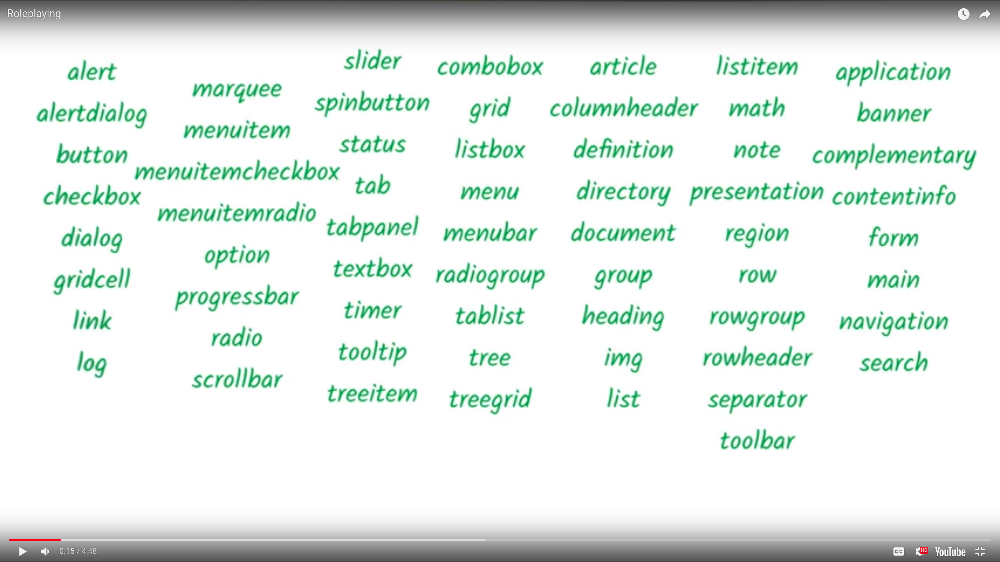

# a11y_notes


## Info

These are accessbility notes.


### For and ID
```html
<input id="roo" type="checkbox">
<label for="roo">
```


### 5 Aria


#### Creating a custom checkbox

```html
<div role="checkbox"
     aria-checked="true">
    Recieve promotional offers
</div>
<!-- Role='checkbox' name/label='Recieve promotional offers' state='checked'
 -->
```


Aria only modifys accessibility tree. So you will have to add in keyboard event
handling, add focusability, modify element behavior, modify element appearance.


#### Common implementation

Role, Name/Label, state, value

#### List of Roles




#### Role Notes 

Make sure that tabindex and role are used in the same place. So when the
keyboard lands on the element the role is conveyed 

Abstract Roles cannot be used on its own. 

#### Links


[Aria Spec 1.1](https://www.w3.org/TR/wai-aria-1.1/)

[Aria 1.0 Roles](https://www.w3.org/TR/wai-aria-1.0/#roles)

[Aria 1.1 Roles](https://www.w3.org/TR/wai-aria-1.1/#roles)

[Aria 1.1 practice guide(draft)](https://www.w3.org/TR/wai-aria-practices-1.1/)

[Definition of Roles](https://www.w3.org/WAI/PF/aria/roles#role_definitions)

[Aria Taxonomy](https://www.w3.org/TR/wai-aria-1.1/img/rdf_model.svg)

[HTML Aria(list of default aria roles built into HTML elements)(No Roles means you )](https://www.w3.org/TR/html-aria/)

#### aria labels

##### notes aira 

aria labels overides text content on screen readers 
```html
<button aria-label="Close">
    x
</button>
<!-- Close will be read not x -->
```

aria-labelledby allows another element to be used as its label for text content.
it can take a list of ids and the text content gets concat into one 
labelledby takes precedence over aria-label and text context.
```html
<div role="radio" aria-labelledby="lb01"></div>
<span id="lb01">Coffee</span>
```


`aria-owns`

`aria-labelby`

`aria-activedescendant`


